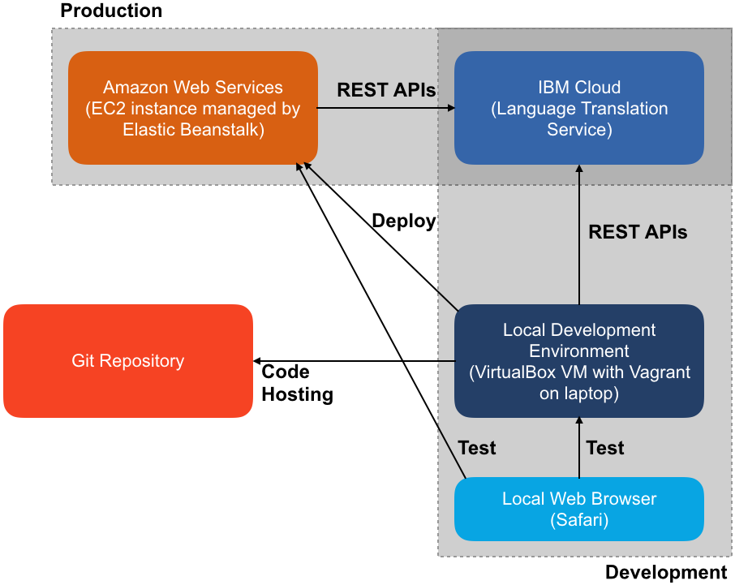

# marist-mscs621-nicholas
### Nicholas Tamburri - MSCS621 Cloud Computing

This is the project Git repository. This project uses an IBM Cloud service to translate words between various languages. The app can be accessed at [this link](language-translator-env.vihuhsbm6k.us-west-2.elasticbeanstalk.com).

The app is hosted on AWS Elastic Beanstalk and uses the Language Translator API from IBM Cloud. It is written in Python using the Flask web framework and the `watson-developer-cloud` Python module from IBM. The source code is located in the eb-docker-flask directory.

The app is deployed using the Elastic Beanstalk CLI. The process is largely defined [on the AWS documentation site](https://docs.aws.amazon.com/elasticbeanstalk/latest/dg/single-container-docker.html). The first steps are to write the Python application (`application.py`) and the `Dockerfile`. The Dockerfile needs to include any necessary dependencies and environment variables, and steps to run the app. In this case, the Dockerfile requires the Python 3.6 Docker image as a base image, includes `application.py` (and all other files in the enclosing directory), installs Flask and IBM Watson cloud libraries, and sets environment variables for the IBM Cloud service credentials. (Note that you need to supply your own API key to deploy this app.) Lastly, the Dockerfile says to expose the app container's port 5000 and run `python application.py` as the entrypoint. Next, issue this command to initialize it as an AWS Elastic Beanstalk appliation:

```
eb init -p docker <application-name>
```

For local testing, run this command to build and start the app (the EB CLI automates building and running the Docker image):

```
eb local run --port 5000
```

The app can then be accessed on a local browser at localhost:5000. The app is deployed to an Elastic Beanstalk environment using this command:

```
eb create <environment-name>
```

The environment can be terminated using the online [Elastic Beanstalk console](https://console.aws.amazon.com/elasticbeanstalk) or this command:

```
eb terminate <environment-name>
```

## Architecture diagram

